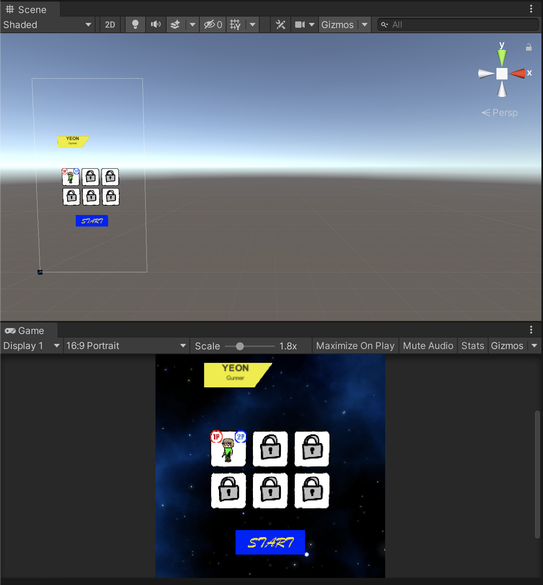
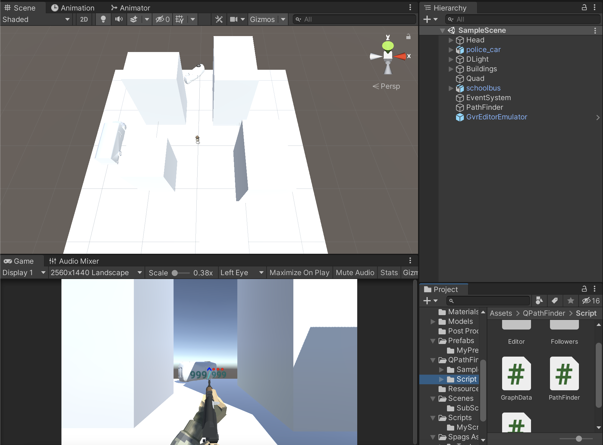
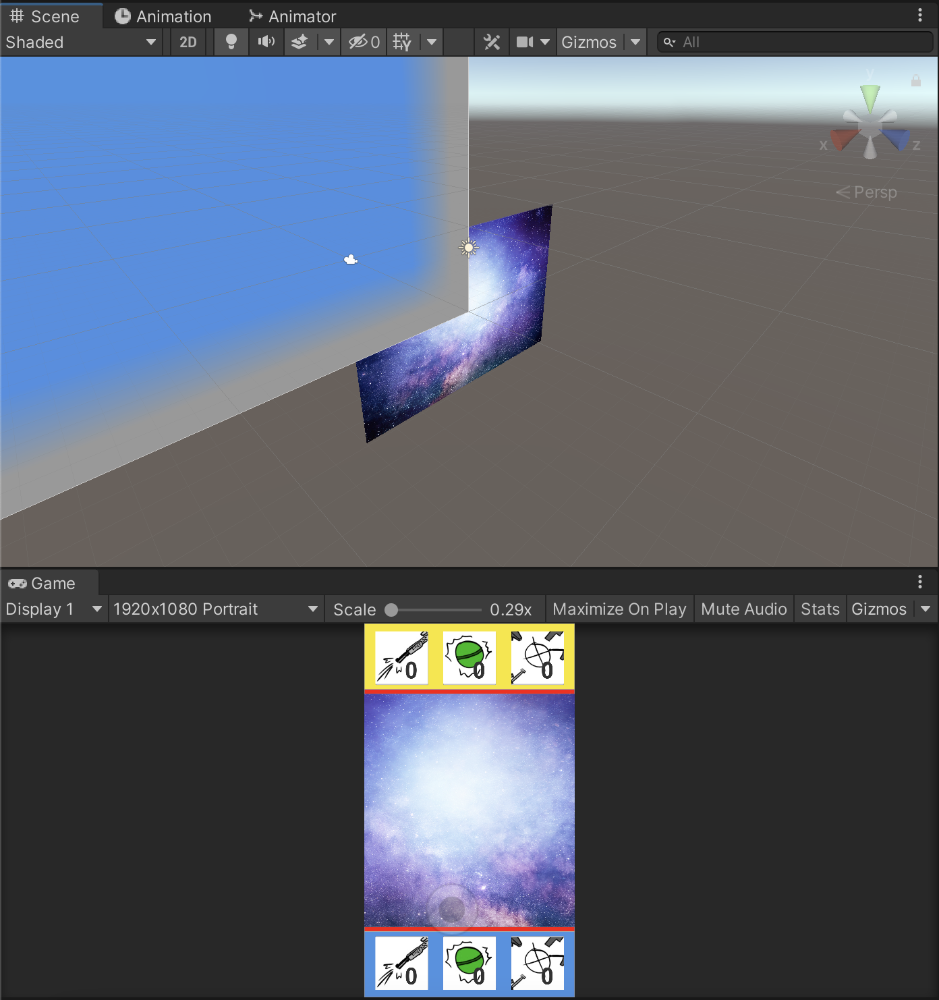
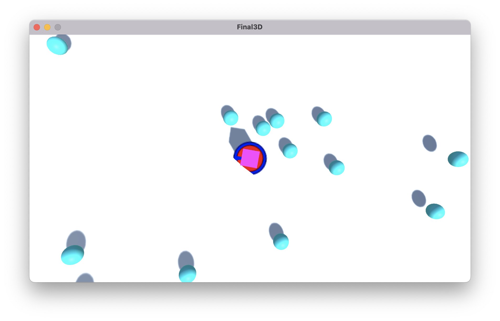

# Portfolio_Basic2022
## 자기소개
### 학력
2023.08 한림대학교 정보과학대학 콘텐츠IT전공 졸업예정 (정보과학대학 빅데이터전공 복수전공)  
2023.02 한림대학교 정보과학대학 수료
2017.03 한림대학교 융합소프트웨어학과(현 정보과학대학 콘텐츠IT전공) 입학  
2017.02 대광고등학교 졸업  
### 자격/면허
2022.09 정보처리기사  
2022.08 일본어능력시험(JLPT)  
2022.01 운전면허 2종 보통  
2018.03 COS Pro(Python) 1급  
### 기술
   
           

***
## 작업물
>[1. 2학년 1학기 Java2](#2018년-2학년-1학기-java2)   
>[2. 2학년 2학기 VR/AR/게임제작기초](#2018년-2학년-2학기-vr-ar-게임제작기초)   
>[3. 3학년 1학기 가상현실프로그래밍](#2019년-3학년-1학기-가상현실프로그래밍)   
>[4. 3학년 2학기 게임프로그래밍](#2019년-3학년-2학기-게임프로그래밍)   
>[5. 4학년 1학기 컴퓨터그래픽스](#2019년-3학년-2학기-게임프로그래밍)   
>[6. 4학년 1학기 캡스톤디자인](#2019년-3학년-2학기-게임프로그래밍)   
>[7. 4학년 2학기 모바일프로그래밍](#2019년-3학년-2학기-게임프로그래밍)   

[문서 자료 보기](https://github.com/bjkim9805/Portfolio_Basic2022/tree/main/ppt_backups, "일부 자료는 아래의 MEGA 클라우드에 있습니다")   
[전체 파일 보기](https://mega.nz/folder/FKdHVCSS#zD2Zroh7XRuYL5ZpZSPKgg)
### 2018년, 2학년 1학기 Java2
당시 기말 프로젝트로는 퀴즈 게임을 준비했습니다. 수업 중 배운 Collection, Exception Handling, FileIO를 적극적으로 활용해 과제를 준비했습니다.
~~~java
String s = "";
String k = "";
int a, p;
System.out.println("문제를 입력하세요. 5지선다 객관식으로 출제해야 합니다.");
System.out.println("입력 종료를 원하시면 새로운 줄에 \"EOF\"를 입력하시면 종료됩니다.");
System.out.println("-------------------------------");
while(true) {
	k = sc.nextLine();
	if(k.compareTo("EOF") == 0) {
		break;
	}
	else {
		s = s + k + "\n";
	}
}
System.out.println("-------------------------------");
//--------------------------------------------------------
System.out.println("입력하신 문제는");
System.out.println(s);
System.out.println("입니다. 문제의 정답을 입력해주세요.");
System.out.print(" >> ");
try {
	a = sc.nextInt();
	System.out.print("문제의 점수를 입력하세요. >> ");
	p = sc.nextInt();
	System.out.println("문제를 등록합니다.");
	registerQuestion(s,a,p);
} catch (InputMismatchException e) {
	System.out.println("잘못 입력하셨습니다.");
}
~~~
이와 같은 방식으로 문제를 제작하고, 제어할 수 있는 프로그램을 제작하고, 그 데이터를 이용해 게임플레이 프로그램을 제작했습니다.
더 자세한 내용은 아래를 참고해 주세요.   
[자료 보기](https://mega.nz/folder/4Ok1XQLR#lF795cbagwsS07Nv7wyk_A)
***
### 2018년, 2학년 2학기 VR AR 게임제작기초
Unity를 이용해 처음으로 작업한 프로젝트로, PvP 탑뷰 슈팅 게임을 제작했습니다. 두 플레이어가 캐릭터를 각각 선택해, 서로 쏘는 탄막을 피하면서 전투를 펼치는 게임을 구상했습니다.

당시 수업에서는 3D 환경에 대해서만 배워서, 2D에 대해 별도로 조사하는 과정이 필요했습니다.
관련 자료는 아래에서 찾아보실 수 있습니다.   
[Docs](https://github.com/bjkim9805/Portfolio_Basic2022/tree/main/ppt_backups/게임제작기초_게임프로그래밍%20중간)   
[Project](https://mega.nz/folder/Mf0SAZID#-KjzbKrFjHNfj3S-rssLBg)   
[Resource](https://mega.nz/folder/BKUwCLhS#LU9r2LpjvQPBWSmGHSOpFg)   

이 작업물은 추후 한 번 더 수정을 했습니다. [아래](#mid-2d)를 참고해 주세요.
***
### 2019년, 3학년 1학기 가상현실프로그래밍
Google Cardboard를 통해 실행하는 VR 게임을 제작했습니다. 중심의 플레이어를 향해 공격해오는 적을 쏴 없애는 슈팅 게임을 만들었습니다.

자료는 아래의 링크에서 확인 바랍니다. 시연 영상 또한 발표 ppt에 내장되어 있습니다.   
[Docs](https://github.com/bjkim9805/Portfolio_Basic2022/tree/main/ppt_backups/VR)   
[Project](https://mega.nz/folder/1acUULQA#vqpJ2AM_8IaI0rbKdtgOzQ)
***
### 2019년, 3학년 2학기 게임프로그래밍
#### Mid-2D
[위](#2018년-2학년-2학기-vr-ar-게임제작기초)에서 작업한 게임을 새로 배운 내용들을 추가해 개선하는 작업을 했습니다.

~~~csharp
if(player == "P2")
{
    if (aiLeft)
    {
        transform.position -= new Vector3(movSpeed, 0, 0) * Time.deltaTime;
        if (transform.position.x < -1.8f) aiLeft = !aiLeft;
    }
    else
    {
        transform.position += new Vector3(movSpeed, 0, 0) * Time.deltaTime;
        if (transform.position.x > 1.8f) aiLeft = !aiLeft;
    }
}
else
{
    transform.position += joystick.GetInputDirection() * movSpeed * Time.deltaTime;
    if (transform.position.x < -2.7f) transform.position = new Vector3(-2.7f, transform.position.y, transform.position.z);
    if (transform.position.x >2.7f) transform.position = new Vector3(2.7f, transform.position.y, transform.position.z);
    if (transform.position.y < -2.9f) transform.position = new Vector3(transform.position.x, -2.9f, transform.position.z);
    if (transform.position.x > 1.7f) transform.position = new Vector3(transform.position.x, 1.7f, transform.position.z);
}
~~~
모바일 환경에서 구동을 위해 터치 조이스틱을 넣고, 네트워크 기능의 구현 전이라 2P를 단순 인공지능으로 변경하였습니다.   
자료는 아래에서 확인할 수 있습니다.   
[Docs](https://github.com/bjkim9805/Portfolio_Basic2022/tree/main/ppt_backups/게임제작기초_게임프로그래밍%20중간)   
[Project](https://mega.nz/folder/xGsRhBjS#NgKv8TN1WbDwFhvpZX-4fg)   
#### Final-3D
몰려오는 수많은 적들을 상대로 버티는 짧은 게임을 만들었습니다. 많은 수의 적이 다가오면서, 그 적들을 쓰러뜨려서 점수를 얻는 시스템입니다.

~~~csharp
void FixedUpdate()
{
    if(player != null)
        body.AddForce((player.transform.position - transform.position).normalized * speed, ForceMode.Acceleration);
    if(body.velocity.magnitude > maxSpeed)
    {
        body.velocity = body.velocity.normalized * maxSpeed;
    }
}

private void OnCollisionEnter(Collision collision)
{
    if(collision.gameObject == player)
    {
        collision.rigidbody.AddForce((transform.position - collision.transform.position).normalized * 30f);
        collision.gameObject.GetComponent<PlayerCtrl>().Damage(damage);
        transform.position = new Vector3(Random.Range(-100f, 100f) + player.transform.position.x, 100, Random.Range(-100f, 100f) + player.transform.position.z);
    }
}

private void OnTriggerEnter(Collider other)
{
    transform.position = new Vector3(Random.Range(-100f, 100f) + player.transform.position.x, 100, Random.Range(-100f, 100f) + player.transform.position.z);

    gameManager.count++;
}
~~~
적 AI는 이런 방식으로 플레이어를 향해 계속 힘을 주는 방식으로 빠르게 밀려오도록 설정했으며, 충돌 판정이 발생한 적 개체를 제거하지 않고 위치만 다시 지정하는 방식으로 연산량을 조절했습니다.   
그 외 자료는 아래에 있습니다.   
[Docks](https://github.com/bjkim9805/Portfolio_Basic2022/tree/main/ppt_backups/게임프로그래밍%20기말)   
[Project](https://mega.nz/folder/dDsXgK5C#Vc3NspsJS1b1DNM9EZK1zw)
***
### 기타 기간
* 2020년부터 군휴학을 했습니다.
  * 기간 도중, 한 팬게임 프로젝트에 참가해 개발자로서 활동했습니다 (자료 비공개 상태).
